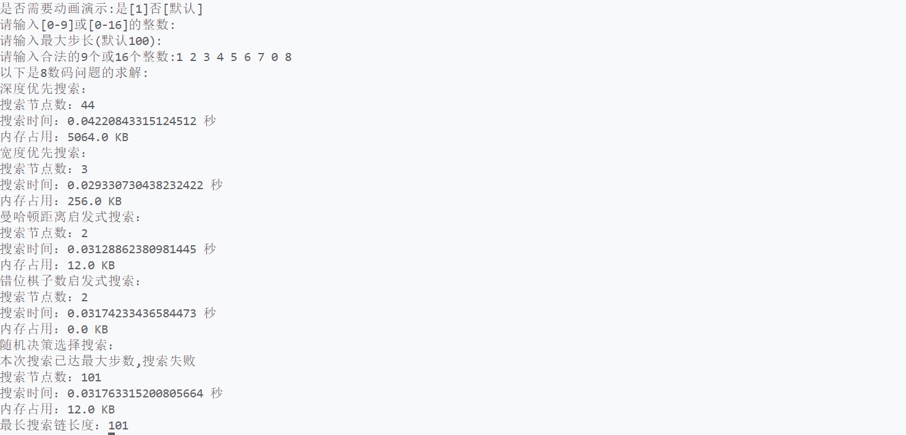
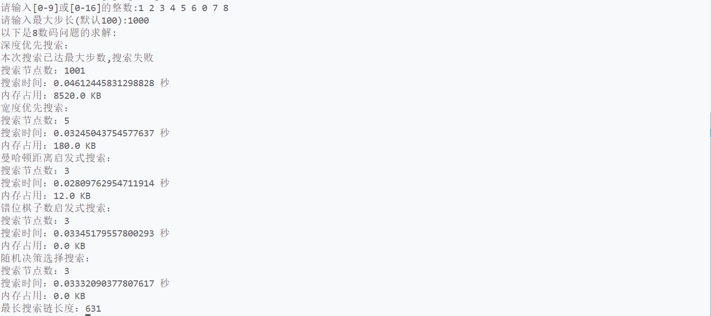
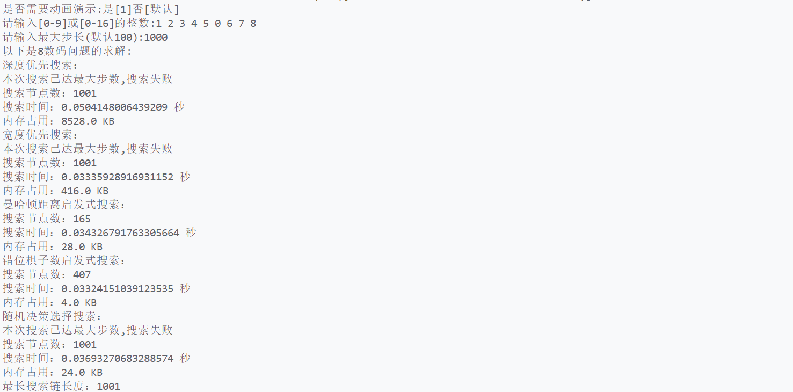
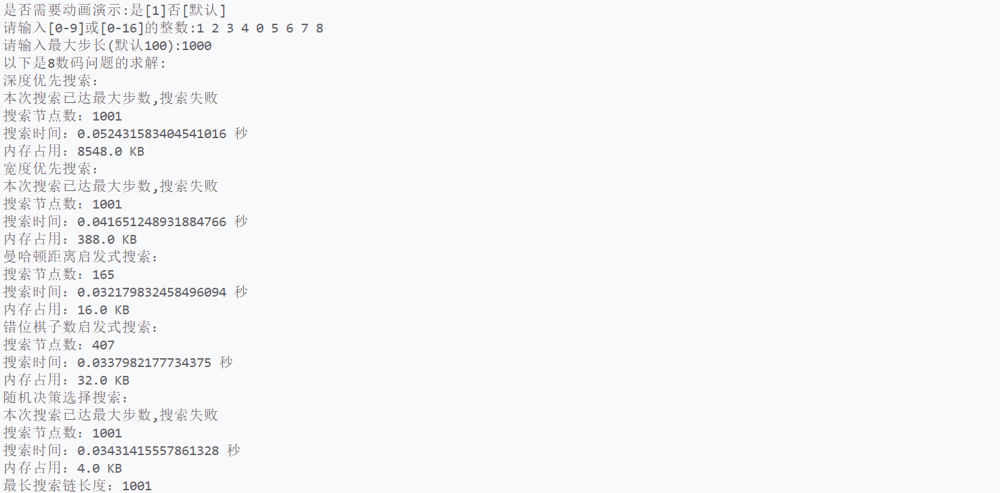
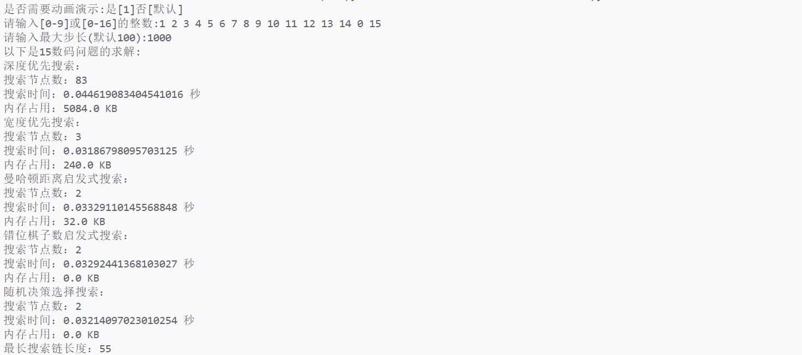
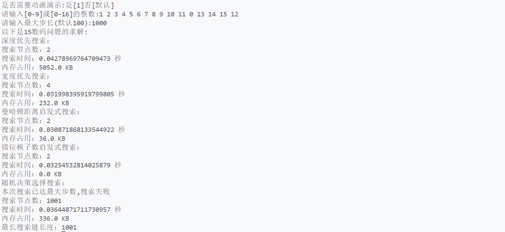
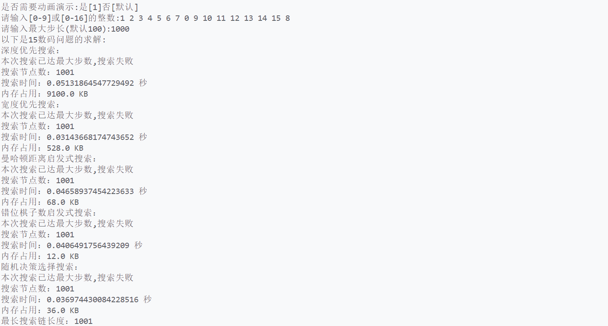
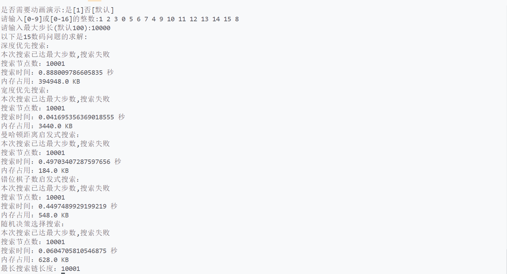

### <center>搜索算法解决8数码和15数码问题</center>

#### <center>学院：软件学院</center>

#### <center>学号：2212195</center>

#### <center>姓名：&emsp;乔昊&emsp;</center>

#### 实验目的
本次实验利用人工智能搜索算法,求解8数码和15数码问题
#### 实验工具
##### 编程语言
本次实验,采用Python语言编写程序
##### 编辑环境
本次实验,使用VScode编辑器,编写Python程序代码
#### 实验方法
##### 深度搜索优先算法
- **DFS方法概述**
1. 深度优先搜索是一种用于遍历或搜索图（包括树这种特殊的图）的算法。它的基本思想是从起始节点开始，沿着一条路径尽可能深地探索下去，直到不能再前进（达到叶子节点或者遇到已经访问过的节点），然后回溯到上一个未完全探索的节点，再沿着另一条路径继续深入探索。
2. 通常使用栈（递归调用栈也可以看作是一种栈结构）来实现。在非递归实现中，栈用于存储待探索的节点。当访问一个节点时，将它的子节点压入栈中，以便后续探索。
3. 为了避免陷入无限循环，需要标记已经访问过的节点。这可以通过一个布尔数组或者集合来实现，记录每个节点是否已经被访问。
   
- **解决8数码问题和15数码问题原理**
1. 生成子状态
从初始状态开始，通过移动空白格来生成新的状态。通过将空白格与它的上、下、左、右位置（如果存在）的数字交换来得到新的状态。
2. 搜索策略
将初始状态压入栈中，然后不断取出栈顶状态进行探索。对于当前状态，生成它的子状态，如果子状态未被访问且不是重复的状态，则将子状态压入栈中，继续探索。
3. 判断目标状态
每生成一个新状态后，都要检查这个状态是否是目标状态。如果是目标状态，则搜索结束，找到了从初始状态到目标状态的路径。
4. 回溯和路径记录
如果在探索过程中发现当前路径无法达到目标状态，就进行回溯。通过记录每个状态的父状态，从而得到从初始状态到目标状态的完整移动路径。

- **代码分析**
1. 空白格交换及路径记录规则
- 建立数据结构栈,存储当前状态的子状态
- 建立元组类型列表,存储已搜索的状态
```
# 若0的位置不在最左侧,则可以向左移动一格
if blank_index % size > 0:
    stack.append((move(current_state, blank_index - 1), path + [current_state]))                
# 若0的位置不在最右侧,则可以向右移动一格
if blank_index % size < size - 1:
    stack.append((move(current_state, blank_index + 1), path + [current_state]))
# 若0的位置不在最顶侧,则可以向上移动一格
if blank_index >= size:
    stack.append((move(current_state, blank_index - size), path + [current_state]))
# 若0的位置不在最底侧,则可以向下移动一格
if blank_index < len(current_state) - size:
    stack.append((move(current_state, blank_index + size), path + [current_state]))
```
2. 空白格交换函数
```
def move(state, move_index):
    # 确定当前状态0的位置
    blank_index = state.index(0)
    # 复制当前的状态
    new_state = state.copy()
    # 交换0与移动位置的目标
    new_state[blank_index], new_state[move_index] = new_state[move_index], new_state[blank_index]
    return new_state
```
3. 状态检查及回溯规则
- 若栈顶状态已经是最终状态,则结束搜索
- 否则,判断是否重复
  - 若不重复,则向下一层搜索
  - 否则,弹出栈顶状态,向邻结点检查直至向上一层回溯
```
if current_state == goal_state:
    end_time = time.time()
    end_memory = psutil.Process().memory_info().rss / 1024
    print(f"深度优先搜索：")
    print(f"搜索节点数：{nodes_searched}")
    print(f"搜索时间：{end_time - start_time} 秒")
    print(f"内存占用：{end_memory - start_memory} KB")
    paint.draw_images(goal_state,"搜索成功",canvas,paint.height/2,root)
    root.destroy()
    return path

if tuple(current_state) not in visited:
    # 添加此次搜索的状态
    visited.add(tuple(current_state))
    size = int(len(current_state) ** 0.5)
    blank_index = current_state.index(0)
    # 确定状态信息
    state_message = "不存在,继续向下一层搜索"
```
##### 广度搜索优先算法
- **BFS方法概述**
1. 广度优先搜索是一种用于遍历或搜索图（包括树这种特殊的图）的算法。它从起始节点开始，首先访问起始节点的所有直接邻居节点，然后再依次访问这些邻居节点的邻居节点，按照离起始节点距离从小到大的顺序一层一层地向外扩展搜索，直到找到目标节点或者遍历完整个图。
2. 通常使用队列来实现。在搜索开始时，将起始节点放入队列。在每一步中，取出队列头部的节点进行访问，然后将该节点的所有未访问的邻居节点放入队列尾部，如此循环，保证了搜索是按照广度优先的顺序进行的。
3. 为了避免重复访问节点，需要对已经访问过的节点进行标记。这可以通过一个布尔数组或者集合来实现，记录每个节点是否已经被访问。
   
- **解决8数码问题和15数码问题原理**
1. 生成子状态
从初始状态开始，通过移动空白格来生成新的状态。通过将空白格与它的上、下、左、右位置（如果存在）的数字交换来得到新的状态。
2. 搜索策略
将初始状态放入队列。在每一步中，取出队列头部的状态进行探索。对于当前状态，生成它的子状态，如果子状态未被访问且满足一定条件（如不是重复的状态），则将子状态放入队列尾部。
3. 判断目标状态
每生成一个新状态后，都要检查这个状态是否是目标状态。如果是目标状态，则搜索结束，找到了从初始状态到目标状态的路径。
4. 回溯和路径记录
如果在探索过程中发现当前路径无法达到目标状态，就进行回溯。通过记录每个状态的父状态，从而得到从初始状态到目标状态的完整移动路径。

- **代码分析**
1. 空白格交换及路径记录规则
- 建立数据结构队列,存储当前状态的子状态
- 建立元组类型列表,存储已搜索的状态
```
# 若0的位置不在最左侧,则可以向左移动一格
if blank_index % size > 0:
    queue.append((move(current_state, blank_index - 1), path + [current_state]))
# 若0的位置不在最右侧,则可以向右移动一格
if blank_index % size < size - 1:
    queue.append((move(current_state, blank_index + 1), path + [current_state]))
# 若0的位置不在最顶侧,则可以向上移动一格
if blank_index >= size:
    queue.append((move(current_state, blank_index - size), path + [current_state]))
# 若0的位置不在最顶侧,则可以向下移动一格
if blank_index < len(current_state) - size:
    queue.append((move(current_state, blank_index + size), path + [current_state]))

```
2. 空白格交换函数
```
def move(state, move_index):
    # 确定当前状态0的位置
    blank_index = state.index(0)
    # 复制当前的状态
    new_state = state.copy()
    # 交换0与移动位置的目标
    new_state[blank_index], new_state[move_index] = new_state[move_index], new_state[blank_index]
    return new_state
```
3. 状态检查及回溯规则
- 若队列第一个状态已经是最终状态,则结束搜索
- 否则,判断是否重复
  - 若不重复,则向邻结点搜索直至向下一层检索
  - 否则,移除队列第一个状态
```
if current_state == goal_state:
    end_time = time.time()
    end_memory = psutil.Process().memory_info().rss / 1024
    print(f"宽度优先搜索：")
    print(f"搜索节点数：{nodes_searched}")
    print(f"搜索时间：{end_time - start_time} 秒")
    print(f"内存占用：{end_memory - start_memory} KB")
    paint.draw_images(goal_state,"搜索成功",canvas,paint.height/2,root)
    root.destroy()
    return path

if tuple(current_state) not in visited:
    visited.add(tuple(current_state))
    size = int(len(current_state) ** 0.5)
    blank_index = current_state.index(0)
```
##### 启发式曼哈顿距离算法
- **启发式曼哈顿距离算法概述**
1. 启发式搜索
   一种在搜索过程中利用启发式信息来引导搜索方向的搜索算法。启发式信息通常是一种对从当前状态到目标状态的距离或代价的估计。这种估计可以帮助搜索算法优先探索那些看起来更有可能接近目标的状态，从而提高搜索效率。
2. 曼哈顿距离
   在二维平面上，对于两个点之间的曼哈顿距离,及x方向和y方向上直线距离的绝对值。
3. 评估函数
   即从起始状态到当前状态的实际代价(移动步数)与从当前状态到目标状态的估计代价（曼哈顿距离）。
4. 优先队列
   根据评估函数的值对状态进行排序，优先选择值较小的状态进行探索。
5. 搜索过程
   从起始状态开始，将起始状态放入优先队列。在每次迭代中，取出优先队列头部的状态进行探索。对于当前状态，生成它的子状态（通过移动空白格），计算子状态的实际代价值和估计代价值，然后计算子状态的评估函数值并将子状态放入优先队列。重复这个过程，直到找到目标状态。
   
- **解决8数码问题和15数码问题原理**
1. 状态表示
将八数码问题中的每个布局状态表示为一个包含 9 个元素的列表，其中 0 表示空白格。
1. 计算曼哈顿距离
对于当前状态中的每个数字（除 0 外），计算它在当前布局中的位置与在目标布局中的位置的曼哈顿距离。将所有数字的曼哈顿距离相加得到当前状态到目标状态的启发式估计距离
1. 搜索过程
   - 开始时，将初始状态放入优先队列，计算其评估函数值。
   - 每次从优先队列中取出值最小的状态进行探索。通过移动空白格生成子状态，为每个子状态计算实际代价值和估计代价值，并将子状态放入优先队列
   - 不断重复这个过程，当取出的状态是目标状态时，搜索结束，此时的路径就是从初始状态到目标状态的解。

- **代码分析**
1. 空白格交换及路径记录规则
- 建立数据结构队列,存储当前状态的子状态
- 建立元组类型列表,存储已搜索的状态
```
if blank_index % size > 0:
    priority_queue.append((manhattan_distance(move(current_state, blank_index - 1), goal_state),
                           move(current_state, blank_index - 1), path + [current_state]))
if blank_index % size < size - 1:
    priority_queue.append((manhattan_distance(move(current_state, blank_index + 1), goal_state),
                           move(current_state, blank_index + 1), path + [current_state]))
if blank_index >= size:
    priority_queue.append((manhattan_distance(move(current_state, blank_index - size), goal_state),
                           move(current_state, blank_index - size), path + [current_state]))
if blank_index < len(current_state) - size:
    priority_queue.append((manhattan_distance(move(current_state, blank_index + size), goal_state),
                           move(current_state, blank_index + size), path + [current_state]))
```
2. 曼哈顿距离计算函数和空白格交换函数
```
def manhattan_distance(state, goal_state):
    # 初始化曼哈顿距离
    distance = 0
    # 初始化格子宽度
    size = int(len(state) ** 0.5)
    # 计算各个格子距目标位置的曼哈顿距离
    for i in range(len(state)):
        if state[i]!= 0:
            goal_pos = goal_state.index(state[i])
            current_row, current_col = i // size, i % size
            goal_row, goal_col = goal_pos // size, goal_pos % size
            distance += abs(current_row - goal_row) + abs(current_col - goal_col)
    return distance

def move(state, move_index):
    # 确定当前状态0的位置
    blank_index = state.index(0)
    # 复制当前的状态
    new_state = state.copy()
    # 交换0与移动位置的目标
    new_state[blank_index], new_state[move_index] = new_state[move_index], new_state[blank_index]
    return new_state
```
3. 状态检查及更新优先队列
- 若队列第一个状态已经是最终状态,则结束搜索
- 否则,判断是否重复
  - 若不重复,则为当前状态生成子状态，并更新优先队列
  - 否则,移除队列第一个状态
```
if current_state == goal_state:
    end_time = time.time()
    end_memory = psutil.Process().memory_info().rss / 1024
    print(f"曼哈顿距离启发式搜索：")
    print(f"搜索节点数：{nodes_searched}")
    print(f"搜索时间：{end_time - start_time} 秒")
    print(f"内存占用：{end_memory - start_memory} KB")
    paint.draw_images(goal_state,"搜索成功",canvas,paint.height/2,root)
    root.destroy()
    return path

if tuple(current_state) not in visited:
    visited.add(tuple(current_state))
    size = int(len(current_state) ** 0.5)
    blank_index = current_state.index(0)

    # 将评估函数值最小的状态放置队列首部
    priority_queue.sort(key=lambda x: x[0])
```
##### 启发式错位棋子数算法
- **启发式错位棋子数算法概述**
1. 启发式搜索
   一种在搜索过程中利用启发式信息来引导搜索方向的搜索算法。启发式信息通常是一种对从当前状态到目标状态的距离或代价的估计。这种估计可以帮助搜索算法优先探索那些看起来更有可能接近目标的状态，从而提高搜索效率。
2. 错位棋子数
   目标状态与当前状态同位置不同值的个数
3. 评估函数
   即从起始状态到当前状态的实际代价(移动步数)与从当前状态到目标状态的估计代价（错位棋子数）。
4. 优先队列
   根据评估函数的值对状态进行排序，优先选择值较小的状态进行探索。
5. 搜索过程
   从起始状态开始，将起始状态放入优先队列。在每次迭代中，取出优先队列头部的状态进行探索。对于当前状态，生成它的子状态（通过移动空白格），计算子状态的实际代价值和估计代价值，然后计算子状态的评估函数值并将子状态放入优先队列。重复这个过程，直到找到目标状态。
   
- **解决8数码问题和15数码问题原理**
1. 状态表示
将八数码问题中的每个布局状态表示为一个包含 9 个元素的列表，其中 0 表示空白格。
1. 计算错位棋子数
对于当前状态中的每个数字（除 0 外），计算它所有在当前布局中的位置与在目标布局中的位置的不同值的个数，得到当前状态到目标状态的启发式估计距离
1. 搜索过程
   - 开始时，将初始状态放入优先队列，计算其评估函数值。
   - 每次从优先队列中取出值最小的状态进行探索。通过移动空白格生成子状态，为每个子状态计算实际代价值和估计代价值，并将子状态放入优先队列
   - 不断重复这个过程，当取出的状态是目标状态时，搜索结束，此时的路径就是从初始状态到目标状态的解。

- **代码分析**
1. 空白格交换及路径记录规则
- 建立数据结构队列,存储当前状态的子状态
- 建立元组类型列表,存储已搜索的状态
```
if blank_index % size > 0:
    priority_queue.append((misplaced_tiles(move(current_state, blank_index - 1), goal_state),
                           move(current_state, blank_index - 1), path + [current_state]))
if blank_index % size < size - 1:
    priority_queue.append((misplaced_tiles(move(current_state, blank_index + 1), goal_state),
                           move(current_state, blank_index + 1), path + [current_state]))
if blank_index >= size:
    priority_queue.append((misplaced_tiles(move(current_state, blank_index - size), goal_state),
                           move(current_state, blank_index - size), path + [current_state]))
if blank_index < len(current_state) - size:
    priority_queue.append((misplaced_tiles(move(current_state, blank_index + size), goal_state),
                           move(current_state, blank_index + size), path + [current_state]))
```
2. 错位棋子数计算函数和空白格交换函数
```
# 计算错位棋子数启发式函数
def misplaced_tiles(state, goal_state):
    return sum([1 for i, j in zip(state, goal_state) if i!= j and i!= 0])

def move(state, move_index):
    # 确定当前状态0的位置
    blank_index = state.index(0)
    # 复制当前的状态
    new_state = state.copy()
    # 交换0与移动位置的目标
    new_state[blank_index], new_state[move_index] = new_state[move_index], new_state[blank_index]
    return new_state
```
3. 状态检查及更新优先队列
- 若队列第一个状态已经是最终状态,则结束搜索
- 否则,判断是否重复
  - 若不重复,则为当前状态生成子状态，并更新优先队列
  - 否则,移除队列第一个状态
```
if current_state == goal_state:
    end_time = time.time()
    end_memory = psutil.Process().memory_info().rss / 1024
    print(f"错位棋子数启发式搜索：")
    print(f"搜索节点数：{nodes_searched}")
    print(f"搜索时间：{end_time - start_time} 秒")
    print(f"内存占用：{end_memory - start_memory} KB")
    paint.draw_images(goal_state,"搜索成功",canvas,paint.height/2,root)
    root.destroy()
    return path
if tuple(current_state) not in visited:
    visited.add(tuple(current_state))
    size = int(len(current_state) ** 0.5)
    blank_index = current_state.index(0)

    # 将评估函数值最小的状态放置队列首部
    priority_queue.sort(key=lambda x: x[0])
```
##### 随即决策算法
- **随即决策搜索算法概述**
1. 随机决策搜索是一种基于随机探索的搜索方法
2. 以一定的概率随机选择其中一个动作来生成下一个状态。
- **解决8数码问题和15数码问题原理**
1. 状态表示
将八数码问题中的每个布局状态表示为一个包含 9 个元素的列表，其中 0 表示空白格。
1. 计算错位棋子数
对于当前状态中的每个数字（除 0 外），计算它所有在当前布局中的位置与在目标布局中的位置的不同值的个数，得到当前状态到目标状态的启发式估计距离
1. 搜索过程
   - 从初始状态开始，根据相等概率随机选择一个动作来移动空白格，从而生成下一个状态。
   - 检查新生成的状态是否为目标状态。如果是目标状态，则搜索成功；如果不是，则继续按照概率分布随机选择动作生成下一个状态。
   - 重复上述过程，直到达到目标状态或者达到预先设定的最大搜索步数。如果达到最大搜索步数还没有找到目标状态，则可以重新从初始状态开始进行下一轮搜索。
- **代码分析**
1. 空白格交换及路径记录规则
- 生成随机数，确定与空白格交换的格子
- 建立元组类型列表,存储已搜索的状态
```
move_index = generate_random_move(current_state)
# 更新当前状态
current_state = move(current_state, move_index)
while tuple(current_state) in visited:
    move_index = generate_random_move(current_state)
    # 更新当前状态
    current_state = move(current_state, move_index)
```
2. 随机状态生成函数和空白格交换函数
```
# 生成随机移动的函数
def generate_random_move(state):
    size = int(len(state) ** 0.5)
    blank_index = state.index(0)
    moves = []
    if blank_index % size > 0:
        moves.append(blank_index - 1)
    if blank_index % size < size - 1:
        moves.append(blank_index + 1)
    if blank_index >= size:
        moves.append(blank_index - size)
    if blank_index < len(state) - size:
        moves.append(blank_index + size)
    
    # 随机刷新当前状态
    random.shuffle(moves)
    return moves[0]

def move(state, move_index):
    # 确定当前状态0的位置
    blank_index = state.index(0)
    # 复制当前的状态
    new_state = state.copy()
    # 交换0与移动位置的目标
    new_state[blank_index], new_state[move_index] = new_state[move_index], new_state[blank_index]
    return new_state
```
3. 状态检查
- 若当前状态是目标状态或已达到最大步数，停止搜索
```
for _ in range(max_steps+1):
        nodes_searched += 1
        if current_state == goal_state:
            end_time = time.time()
            end_memory = psutil.Process().memory_info().rss / 1024
            print(f"随机决策选择搜索：")
            print(f"搜索节点数：{nodes_searched}")
            print(f"搜索时间：{end_time - start_time} 秒")
            print(f"内存占用：{end_memory - start_memory} KB")
            paint.draw_images(goal_state,"搜索成功",canvas,paint.height/2,root)
            root.destroy()
            return path
```
#### 实验结论
##### 测试样例
1. **8数码问题**
- 1 2 3 4 5 6 7 0 8

- 1 2 3 4 5 6 0 7 8

- 1 2 3 4 5 0 6 7 8

- 1 2 3 4 0 5 6 7 8


1. **15数码问题**
- 1 2 3 4 5 6 7 8 9 10 11 12 13 14 0 15

- 1 2 3 4 5 6 7 8 9 10 11 0 13 14 15 12

- 1 2 3 4 5 6 7 0 9 10 11 12 13 14 15 8

- 1 2 3 0 5 6 7 4 9 10 11 12 13 14 15 8

##### 结论
1. 搜索结点数
   - 启发式搜索总体上远远少于DFS搜索
   - BFS搜索则接近于启发式搜索
2. 搜索花费时间
   - DFS搜索时间往往最长
   - 其它搜索时间接近
3. 搜索花费空间
   - DFS搜索所耗内存往往最大
   - 其它搜索所耗内存接近
4. 最长搜索链
   - 随机搜索往往易出现最长搜索链
##### 分析
1. DFS
   DFS 是沿着一条路径尽可能深地探索，可能会陷入很深的子树而浪费时间在一些不太可能达到目标的路径上。而且如果目标状态在较浅的层次，而 DFS 先探索了很深的层次，会导致效率低下。
2. BFS
   BFS 是一层一层地搜索，能够保证找到的路径是最短路径（如果存在）。但它的缺点是需要存储较多的节点，特别是当状态空间较大且最短路径较长时，队列可能会占用大量的空间，导致性能下降。
3. 启发式曼哈顿距离搜索
   曼哈顿距离启发式搜索利用启发式信息来引导搜索，优先探索那些看起来更接近目标的状态。这使得它能够在一定程度上避免盲目搜索，比 DFS 和 BFS 更有效地利用搜索资源。
4. 启发式错位棋子数搜索
   通过计算错位棋子数来估计到目标状态的距离，引导搜索方向。如果错位棋子数能够较好地反映实际距离，就可以减少搜索时间和空间。
5. 随机决策搜索
   随机决策搜索的性能差主要是因为它没有利用问题的结构信息，完全依赖随机选择动作。它可能会在一些无效的状态之间反复跳转，浪费大量的时间，而且找到目标状态的概率较低，除非进行大量的尝试。
#### 实验心得
&emsp;&emsp;在本次实验中通过深入探究深度优先搜索（DFS）、广度优先搜索（BFS）、曼哈顿距离启发式搜索、错位棋子数启发式搜索以及随机决策搜索用于解决八数码问题的过程中，我对各算法原理有了更深入的理解。<br/>
&emsp;&emsp;DFS 深度优先遍历状态空间，简洁但易陷入深层无效探索且需关注重复访问；BFS 逐层搜索能保最短路径却空间消耗大。启发式搜索利用曼哈顿距离或错位棋子数估计目标距离引导搜索，前者更精准，后者较直观，二者有效减少盲目性但依赖准确的启发式函数。随机决策搜索随机选动作，缺乏引导致效率极低且难寻最优路径。实验中也直观感受到性能差异，时间复杂度上 DFS 简单用例可能快但复杂时耗时剧增，BFS 较稳定但大规模仍久，启发式搜索多数情况快速收敛，随机决策搜索时间难测。空间复杂度方面，DFS 与搜索深度有关，BFS 受分支因子和最短路径影响大，启发式搜索较 BFS 降低，随机决策搜索很低。<br/>
&emsp;&emsp;通过这次实验，我不仅掌握了多种搜索算法的实现和应用，更重要的是学会了如何分析和比较不同算法的性能，这将为我今后在解决更复杂的实际问题时选择合适的算法提供有力的依据，也为进一步学习和研究人工智能领域的其他算法奠定了坚实的基础。<br/>
